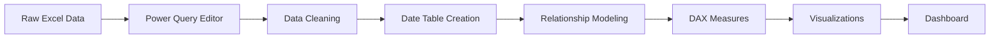

# Road Accident Analysis Dashboard


> A comprehensive Power BI dashboard analyzing UK road traffic accident data to provide actionable insights for road safety improvement and accident prevention strategies.

## Table of Contents
- [Overview](#overview)
- [Files in Repository](#files-in-repository)
- [Dataset](#dataset)
- [Key Features](#key-features)
- [Dashboard Screenshots](#dashboard-screenshots)
- [Key Insights](#key-insights)
- [Installation & Usage](#installation--usage)
- [Technical Implementation](#technical-implementation)
- [Project Methodology](#project-methodology)
- [Contributing](#contributing)
- [License](#license)

## Overview

This project demonstrates the complete development lifecycle of a dynamic and interactive Power BI dashboard, from data gathering to final visualization. The dashboard serves as a comprehensive analytical tool for road safety authorities, enabling data-driven decision making to reduce accidents and improve public safety.

**Target Stakeholders:**
- Ministry of Transport
- Road Transport Department  
- Police Force
- Emergency Services
- Public Safety Officials

## Files in Repository

```
📁 Road-Accident-Analysis-Dashboard/
├── 📊 Road_Accident_Data.xlsx          # Raw accident dataset
├── 📈 Road_Accident_Dashboard.pbix     # Complete Power BI dashboard
└── 📝 README.md                        # Project documentation
```

## Dataset

**Source:** UK Road Traffic Accident Data  
**Records:** 300,000+ accident records  
**Time Period:** 2021-2022  
**File Format:** Excel (.xlsx)

### Key Columns:
| Column | Description |
|--------|-------------|
| `Accident_Index` | Unique identifier for each accident |
| `Accident_Date` | Date and time of accident |
| `Accident_Severity` | Fatal, Serious, or Slight |
| `Latitude/Longitude` | Geographic coordinates |
| `Weather_Conditions` | Weather at time of accident |
| `Road_Type` | Single carriageway, dual carriageway, etc. |
| `Vehicle_Type` | Car, motorcycle, bicycle, etc. |
| `Number_of_Casualties` | Total casualties per accident |
| `Urban_or_Rural_Area` | Area classification |

## Key Features

### 🎯 Primary KPIs
- **Total Casualties** with Year-on-Year growth
- **Total Accidents** with YoY comparison  
- **Accident Severity Breakdown** (Fatal/Serious/Slight)

### 📊 Secondary KPIs
- Casualties by Vehicle Type
- Monthly Trend Analysis
- Road Type Analysis
- Urban vs Rural Distribution
- Light Conditions Impact

### 🔧 Interactive Elements
- **Dynamic Filters:** Weather, road surface, time period
- **Cross-filtering:** Click any chart to filter others
- **Geographic Mapping:** Interactive accident hotspots
- **Time Intelligence:** YoY growth calculations
- **Custom Groupings:** Simplified categorical views

## Dashboard Screenshots

*[Add screenshots of your dashboard here]*

## Key Insights

### 🚨 Critical Findings

**High-Risk Factors:**
- **Urban Areas** account for 79% of total accidents
- **Daylight Conditions** contribute to 73% of casualties
- **Single Carriageways** show highest accident rates
- **Dry Road Conditions** paradoxically have more accidents

**Vehicle Analysis:**
- **Cars** involved in 85% of accidents
- **Motorcycles** have highest severity ratio
- **Agricultural vehicles** lowest accident rate

### 💡 Strategic Recommendations

1. **Infrastructure Investment:**
   - Prioritize urban road infrastructure upgrades
   - Convert high-risk single-lane roads to dual carriageways

2. **Safety Measures:**
   - Enhanced daylight safety protocols
   - Targeted interventions in urban areas
   - Weather-specific safety campaigns

## Installation & Usage

### Prerequisites
- Microsoft Power BI Desktop (latest version)
- Excel 2016 or later (for data file)

### Quick Start
```bash
1. Clone this repository
   git clone https://github.com/yourusername/road-accident-dashboard.git

2. Open Power BI Desktop

3. Load the .pbix file
   File → Open → Road_Accident_Dashboard.pbix

4. Refresh data if needed
   Home → Refresh
```

### Navigation Guide
1. **Filter Panel (Right):** Use slicers to filter entire dashboard
2. **KPI Cards (Top):** View primary metrics and growth indicators  
3. **Charts (Middle):** Interactive visualizations with cross-filtering
4. **Map (Bottom):** Geographic distribution with hover tooltips

## Technical Implementation

### 🛠️ Tools Used
- **Power BI Desktop** - Dashboard development
- **Power Query Editor** - Data transformation
- **DAX** - Custom calculations
- **PowerPoint** - Background design

### 📊 Data Processing Pipeline



### 🧮 Key DAX Measures

**Current Year Casualties:**
```dax
Current Year Casualties = 
TOTALYTD(
    SUM(Data[Number_of_Casualties]), 
    Calendar[Date]
)
```

**Previous Year Casualties:**
```dax
Previous Year Casualties = 
CALCULATE(
    [Current Year Casualties], 
    SAMEPERIODLASTYEAR(Calendar[Date])
)
```

**YoY Growth Percentage:**
```dax
YoY Growth % = 
DIVIDE(
    [Current Year Casualties] - [Previous Year Casualties],
    [Previous Year Casualties],
    0
)
```

### 🗓️ Calendar Table Creation
```dax
Calendar = 
CALENDAR(
    MIN(Data[Accident_Date]),
    MAX(Data[Accident_Date])
)
```

## Project Methodology

This project follows a systematic **9-step approach:**

| Step | Phase | Description |
|------|-------|-------------|
| 1️⃣ | **Requirements Gathering** | Defined stakeholder needs and success metrics |
| 2️⃣ | **Stakeholder Mapping** | Identified key users and decision-makers |
| 3️⃣ | **Data Review** | Analyzed raw data quality and structure |
| 4️⃣ | **Data Connection** | Established reliable data pipeline |
| 5️⃣ | **Data Cleaning** | Processed and standardized data |
| 6️⃣ | **Data Processing** | Applied transformations and calculations |
| 7️⃣ | **Data Modeling** | Created relationships and measures |
| 8️⃣ | **Design & Visualization** | Developed user interface |
| 9️⃣ | **Dashboard Development** | Built final interactive solution |

## 🔄 Data Updates

To update with new data:

```bash
1. Replace Excel file (maintain same structure)
2. Open Power BI Desktop
3. Navigate to: Home → Transform Data → Refresh Preview
4. Close & Apply changes
5. Verify data integrity
```

## 📈 Performance Metrics

- **Load Time:** < 5 seconds
- **Data Rows:** 300,000+
- **Refresh Time:** < 30 seconds
- **File Size:** ~25MB

## Contributing

Contributions are welcome! Please feel free to submit a Pull Request.

### How to Contribute:
1. Fork the repository
2. Create your feature branch (`git checkout -b feature/AmazingFeature`)
3. Commit your changes (`git commit -m 'Add some AmazingFeature'`)
4. Push to the branch (`git push origin feature/AmazingFeature`)
5. Open a Pull Request

## 🤝 Connect with Me

[](your-linkedin-url)
[](your-portfolio-url)

## License

This project is licensed under the MIT License - see the [LICENSE](LICENSE) file for details.

## ⭐ Star History

If this project helped you, please consider giving it a ⭐!

---

<div align="center">

**Made with ❤️ and Power BI**

*Driving road safety through data-driven insights*

</div>
